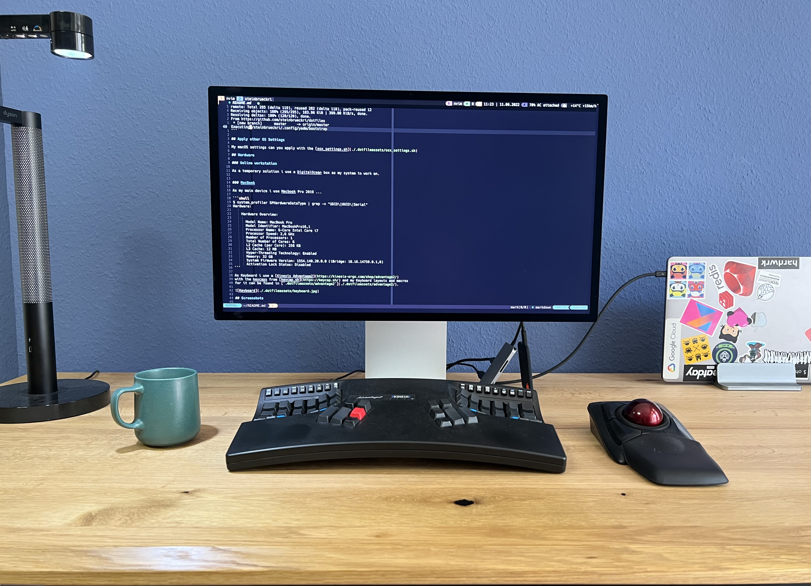
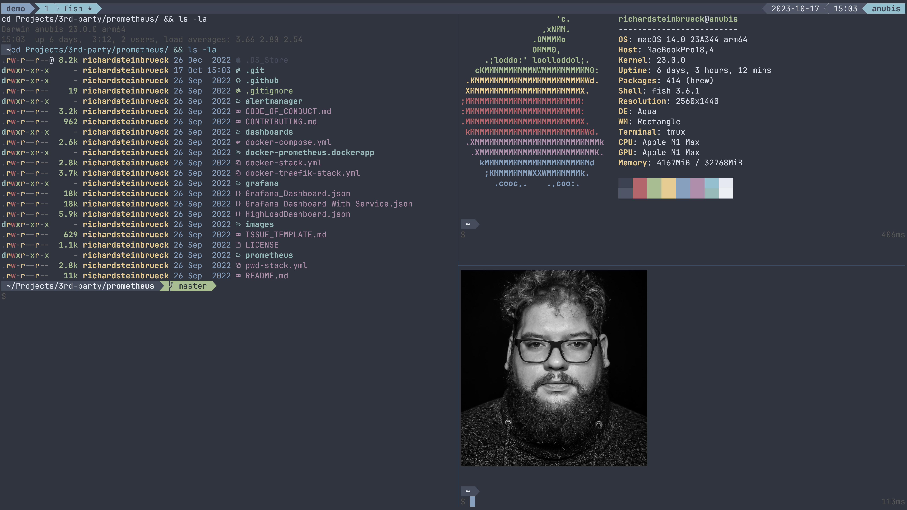
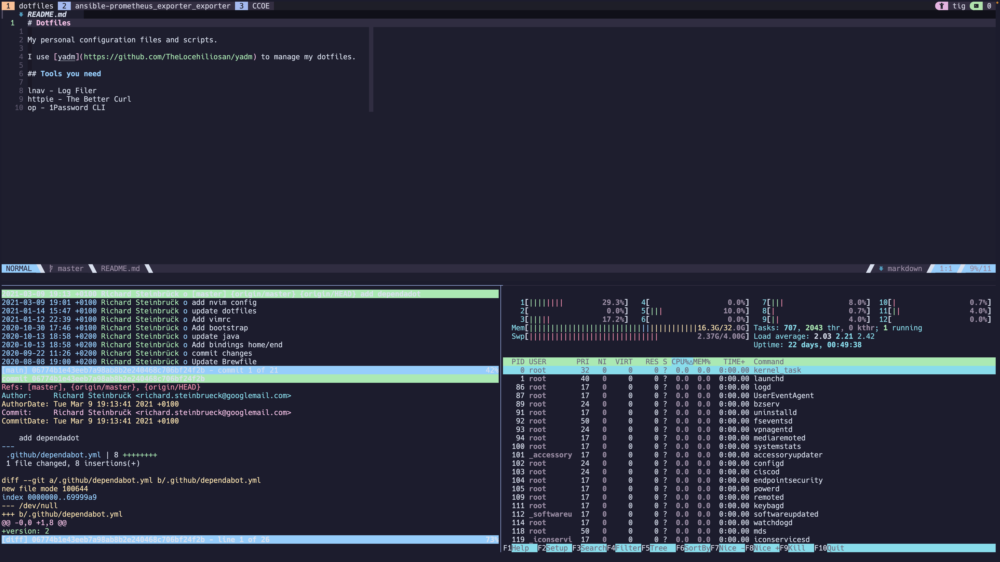

# My Dotfiles


Hi! These are my dotfiles that I use every day, primarily the terminal.
If you find something interesting, go ahead and take whatever you want from my dotfiles.

It is managed using [yadm](https://github.com/TheLocehiliosan/yadm/), a dotfile
manager. This makes it simple to set up a new computer with these files. In
order to set up a new system with these dotfiles, do the following:

## Getting Started

First of all you need yadm, this can be installed on macOS via homebrew or on
Linux via the package manager of your choice.

## macOS

### Install Homebrew

```shell
/bin/bash -c "$(curl -fsSL https://raw.githubusercontent.com/Homebrew/install/master/install.sh)"
```

### Install tools with Homebrew

```shell
brew bundle install --file=.Brewfile
```

## Install tools on ArchLinux

```shell
xargs pacman -S --needed --noconfirm < [.pacmanfile](./.pacmanfile)
```

## Clone dotfiles with [yadm](https://yadm.io/)

```shell
$ yadm clone https://github.com/steinbrueckri/dotfiles
Initialized empty shared Git repository in /steinbrueckri/.config/yadm/repo.git/
remote: Enumerating objects: 295, done.
remote: Counting objects: 100% (283/283), done.
remote: Compressing objects: 100% (133/133), done.
remote: Total 295 (delta 119), reused 282 (delta 118), pack-reused 12
Receiving objects: 100% (295/295), 183.96 KiB | 399.00 KiB/s, done.
Resolving deltas: 100% (120/120), done.
From https://github.com/steinbrueckri/dotfiles
 * [new branch]      master     -> origin/master
Executing /steinbrueckri/.config/yadm/bootstrap
```

## Hardware

### Equipment list

#### Mobile

| Device Class  | Vendor      | Model                                                                                              |
|---------------|-------------|----------------------------------------------------------------------------------------------------|
| Keyboard      | Nuphy       | [Air60 V2](https://nuphy.com/products/air60-v2)                                                    |
| Keyboard Case | Nuphy       | [NuFolio V3](https://nuphy.com/collections/accessories/products/nufolio-v3-for-air60-v2)           |
| Powerbank     | Anker       | [737 Powerbank aka PowerCore 24K](https://www.anker.com/eu-de/products/a1340-250w-power-bank)      |
| Mobile Router | GL.iNet     | [GL-XE300 (Puli)](https://www.gl-inet.com/products/gl-xe300/)                                      |
| Backpack      | Peak Design | [Everyday Backpack](https://www.peakdesign.com/eu/products/everyday-backpack?Size=30L&Color=Black) |
| Tech Pouch    | Peak Design | [Field Pouch V2](https://www.peakdesign.com/eu/products/field-pouch?Color=Black)                   |

#### Office

| Device Class | Vendor      | Model                                                                                                                                                       |
| ------------ | ----------- | ----------------------------------------------------------------------------------------------------------------------------------------------------------- |
| Desk         | BoHo-Moebel | [Premium Line with oak table top](https://www.boho-moebel.de/produkte/hoehenverstellbare-tischgestelle/premium-line)                                        |
| Desk Shelf   | Balolo      | [Setup Cockpit](https://www.balolo.de/en/products/setup-cockpit-large)                                                                                      |
| Chaire       | HÅG         | [Capisco 8020](https://www.hag-shop.com/hag/hag-capisco-puls/hag-capisco-puls-8020.html)                                                                    |
| Desk Lamp    | Dyson       | [Solarcycle Morph](https://www.dyson.de/leuchten/tischleuchten/solarcycle-morph-cd06/schwarz)                                                               |
| Monitor      | Apple       | [Studio Display](https://www.apple.com/de/studio-display/)                                                                                                  |
| Keyboard     | Kinesis     | [Advantage360](https://kinesis-ergo.com/keyboards/advantage360/)                                                                                            |
| Mouse        | Kensington  | [Expert Mouse Wireless Trackball](https://www.kensington.com/de-de/p/produkte/ergonomie/ergonomische-eingabeger%C3%A4te/kabelloser-expert-mouse-trackball/) |
| Headphones   | Apple       | [AirPods Max](https://www.apple.com/de/shop/buy-airpods/airpods-max/space-grau)                                                                             |

### Notebook

As my main device i use Macbook Pro 2021 ...

```shell
$ system_profiler SPHardwareDataType | grep -v "UDID\|UUID\|Serial"
Hardware:

    Hardware Overview:

      Model Name: MacBook Pro
      Model Identifier: MacBookPro18,4
      Model Number: Z15K0004WD/A
      Chip: Apple M1 Max
      Total Number of Cores: 10 (8 performance and 2 efficiency)
      Memory: 32 GB
      System Firmware Version: 8419.80.7
      OS Loader Version: 8419.80.7
      Activation Lock Status: Disabled
```

As Keyboard i use a [Kinesis Advantage360](https://kinesis-ergo.com/keyboards/advantage360/)
with the blank keycap set from [Kinesis kc360-bk](https://kinesis-ergo.com/shop/kc360-bk/)
and my Keyboard layouts and macros
for it can be found in [steinbrueckri/Adv360-Pro](https://github.com/steinbrueckri/Adv360-Pro).


NOTE: Picture need a update 😆

## Key mappings and Aliases

My vim leader key is <space> and the tmux leader is <ctrl><a>. The following
table is generate by ChatGPT so its maybe a lie. ;)

<!-- markdownlint-capture -->
<!-- markdownlint-disable -->

<!-- generate-table-start -->
### nvim Keybindings

| Mode | Key         | Action                                                                     |
|------|-------------|----------------------------------------------------------------------------|
| i    | jk          | Exit insert mode                                                           |
| n    | <Esc>       | Clear search highlight                                                     |
| n    | U           | Redo last undone change                                                    |
| v    | <           | Indent left and reselect                                                   |
| v    | >           | Indent right and reselect                                                  |
| x    | <leader>x   | Delete without losing register contents                                    |
| x    | <leader>p   | Paste over visual selection without losing register contents               |
| n    | <Tab>       | Next buffer                                                                |
| n    | <S-Tab>     | Previous buffer                                                            |
| n    | <leader>q   | Close current buffer                                                       |
| n    | <leader>Q   | Force close current buffer                                                 |
| n    | <leader>bd  | Delete buffer                                                              |
| n    | <leader>bm  | Delete all marks                                                           |
| n    | <leader>w   | Save file                                                                  |
| n    | <leader>N   | Create new buffer                                                          |
| n    | <leader>e   | Toggle file tree                                                           |
| n    | gF          | Create file and open                                                       |
| n    | n           | Find next and center                                                       |
| n    | N           | Find previous and center                                                   |
| n    | <leader>fm  | Execute make target                                                        |
| n    | <leader>fa  | Search in files                                                            |
| n    | <leader>fc  | Search in config files                                                     |
| n    | <leader>ff  | Search all files (ignoring .git)                                           |
| n    | <leader>fe  | Find emojis                                                                |
| n    | <leader>fp  | Show yank history                                                          |
| n    | <leader>fo  | Show recent files                                                          |
| n    | <leader>fr  | Open search and replace                                                    |
| n    | <leader>ft  | Find open TODOs                                                            |
| n    | <leader>gf  | Open Fork and show Git status                                              |
| n    | <leader>gb  | Git blame line                                                             |
| n    | <leader>gg  | Open line in Github                                                        |
| n    | <leader>gl  | Open LazyGit                                                               |
| n    | <leader>fb  | Find git branches                                                          |
| n    | <leader>tw  | Toggle word wrap                                                           |
| n    | <leader>ud  | Toggle database UI                                                         |
| n    | <leader>tm  | Toggle Markdown preview                                                    |
| n    | Z           | Show spell suggests                                                        |
| n    | yc          | Duplicate a line and comment out the first line                            |
| n    | <leader>ts  | Toggle Screenkey                                                           |
| n    | <leader>tt  | Toggle Terminal                                                            |
| n    | <leader>to  | Toggle Symbols                                                             |
| n    | <leader>td  | Toggle Diagnostics                                                         |
| n    | <leader>tl  | Toggle LSP Definitions                                                     |
| n    | <leader>nn  | Create quick note                                                          |
| n    | <leader>nf  | Search notes                                                               |
| n    | <leader>no  | Open note in Silverbullet                                                  |
| n    | <leader>tq  | Toggle quickfix list                                                       |
| n    | ]q          | Next item quickfix list                                                    |
| n    | [q          | Previous item quickfix list                                                |
| n    | <leader><Up>    | Goto split up                                                             |
| n    | <leader><Down>  | Goto split down                                                           |
| n    | <leader><Left>  | Goto split left                                                           |
| n    | <leader><Right> | Goto split right                                                          |
| n    | <leader>sh      | Create horizontal split                                                   |
| n    | <leader>sv      | Create vertical split                                                     |

### tmux Keybindings

| Key          | Action                                       |
|--------------|----------------------------------------------|
| C-a          | Send prefix                                  |
| _            | Split window horizontally                     |
| -            | Split window vertically                       |
| h            | Switch to home                               |
| u            | Switch to userlike                           |
| C            | New window                                   |
| y            | Toggle synchronize-panes and display message  |
| v            | Enter copy mode                              |
| p            | Paste buffer                                 |
| r            | Reload ~/.tmux.conf and display message      |
| - (copy-mode)| Copy-pipe-and-cancel to clipboard            |

### Fish Aliases

| Alias                | Command                                                                                       |
|----------------------|-----------------------------------------------------------------------------------------------|
| vim                  | nvim                                                                                          |
| vi                   | nvim                                                                                          |
| v                    | nvim                                                                                          |
| n                    | nvim                                                                                          |
| nvim-switch-nightly  | bob use nightly                                                                              |
| nvim-switch-stable   | bob use stable                                                                               |
| lg                   | lazygit                                                                                      |
| lgd                  | lazydot                                                                                      |
| lazydot              | lazygit -ucd ~/.local/share/yadm/lazygit -w ~ -g ~/.local/share/yadm/repo.git                |
| lol                  | git log --pretty=oneline --abbrev-commit --graph --decorate                                   |
| gp                   | git pull                                                                                      |
| kx                   | kubectx                                                                                      |
| k                    | kubectl                                                                                      |
| kc                   | kubecolor                                                                                    |
| kn                   | kubens                                                                                       |
| k-debug              | kubectl run --namespace default -i --tty 'debug-default-$USER' --image=steinbrueckri/debug --restart=Never --rm=true -- bash |
| k-debug-app          | kubectl run --namespace istio-apps -i --tty 'debug-$USER' --image=steinbrueckri/debug --restart=Never --rm=true -- bash |
| newpyenv             | uv venv .venv --python 3.12 && echo '{ "venvPath": ".", "venv": ".venv", "include": ["src", "tests"], "exclude": ["**/__pycache__", ".pytest_cache", ".ruff_cache", ".venv"] }' > pyrightconfig.json && mkdir -p src tests && source .venv/bin/activate.fish |
| activate_env_datacenter | source ~/Userlike/UserlikeDatacenter/.venv/bin/activate.fish                               |
| activate_env_code    | source ~/Userlike/Userlike/.venv/bin/activate.fish                                           |
| gcpil                | gcloud compute instances list                                                                |
| gcpal                | gcloud compute addresses list                                                                |
| gcpssh               | gcloud compute ssh                                                                           |
| gcpsshi              | gcloud compute ssh --internal-ip                                                             |
| gcpsshiap            | gcloud compute ssh --tunnel-through-iap                                                      |
| gcprdpiap            | gcloud compute start-iap-tunnel $1 3389 --local-host-port=localhost:3389 --zone=$2           |
| do                   | doctl                                                                                        |
| do-new               | doctl compute droplet create tmp --region ams3 --size s-2vcpu-2gb --image ubuntu-22-04-x64 --user-data-file .dotfileassets/digitalocean-cloudinit.yaml --ssh-keys "df:17:95:8d:31:56:39:27:d1:04:e3:12:52:36:ed:5b" |
| do-new-ssh           | ssh $(doctl compute droplet list | grep tmp | awk "{ print $3}")                             |
| localvm              | multipass launch -c 4 -m 4G -d 50G -n localvm 20.04 --cloud-init .dotfileassets/multipass-common.yaml |
| dr                   | docker run -it --rm --entrypoint /bin/sh                                                     |
| rm-images            | docker rmi (docker images -q)                                                                |
| tssh                 | tsh ssh (tsh ls \| tail --lines=+3 \| fzf -e \| head -n 1 \| cut -d ' ' -f1)                  |
| pwgen                | date +%s \| sha256sum \| base64 \| head -c 32 ; echo                                        |
| cat                  | bat                                                                                          |
| hosts                | hosts --auto-sudo                                                                            |
| ls                   | eza --icons                                                                                  |
| top                  | btop                                                                                         |
| watch                | viddy                                                                                        |
| myip                 | curl -s -H "Accept: application/json" ipinfo.io \| jq -r .ip                                  |
| ag                   | rg                                                                                           |
| tailscale            | /Applications/Tailscale.app/Contents/MacOS/Tailscale                                         |
| sslcheck             | nmap --script ssl-cert -p 443                                                                |
| sslyze               | docker run --rm -it nablac0d3/sslyze:latest                                                 |
| lightmode            | themr rose-pine-dawn                                                                         |
| darkmode             | themr rose-pine-moon                                                                         |
| kill-ansible-ssh     | ps aux \| grep "ansible-" \| grep "\[mux\]" \| awk "{print \$2}" \| xargs kill -9            |
<!-- generate-table-stop -->
<!-- markdownlint-restore -->

## Screenshots

Here’s a glimpse of my terminal and setup:





## Tests

### Running Tests Locally

```bash
# All tests
just test

# Debug mode (drops to shell on failure)
just test-debug

# Open shell in test container
just shell
```

### CI

GitHub Actions runs `just test` (excludes slow markers for fast feedback).
Scheduled daily runs execute `just test-all`.

### Requirements

- Docker
- [Just](https://github.com/casey/just) command runner

### Missing Features

Here are some planned improvements for future versions:

- Testing with multiple Neovim versions
- Testing across various Linux distributions
- Testing on macOS
