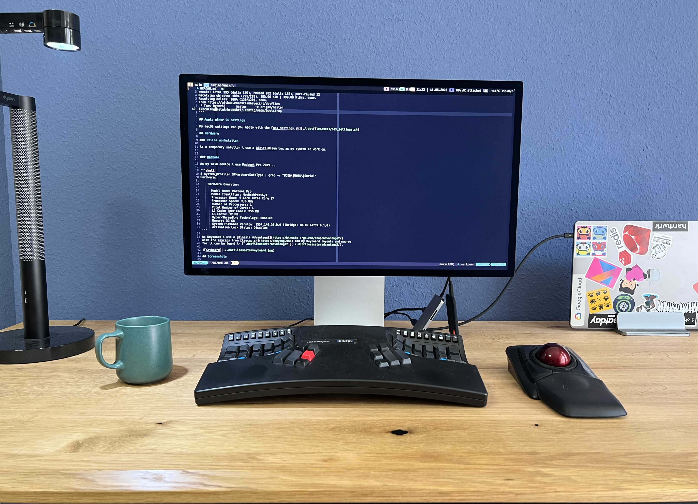
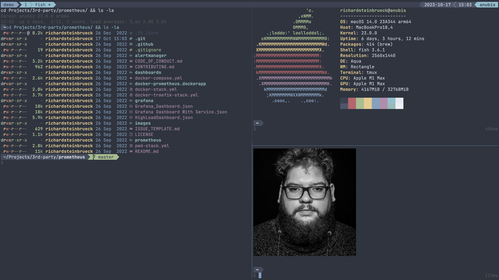
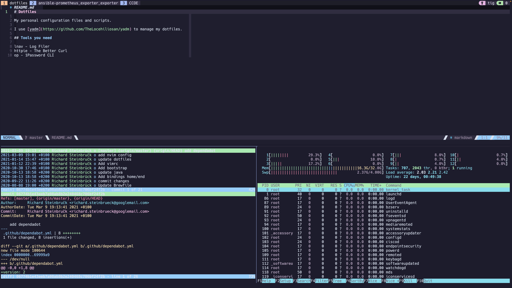

# My Dotfiles


Hi! These are my dotfiles that I use every day, primarily the terminal.
If you find something interesting, go ahead and take whatever you want from my dotfiles.

It is managed using [yadm](https://github.com/TheLocehiliosan/yadm/), a dotfile
manager. This makes it simple to set up a new computer with these files. In
order to set up a new system with these dotfiles, do the following:

## Getting Started

First of all you need yadm, this can be installed on macOS via homebrew or on
Linux via the package manager of your choice.

## macOS

### Install Homebrew

```shell
/bin/bash -c "$(curl -fsSL https://raw.githubusercontent.com/Homebrew/install/master/install.sh)"
```

### Install tools with Homebrew

```shell
brew bundle install --file=.Brewfile
```

## Install tools on ArchLinux

```shell
xargs pacman -S --needed --noconfirm < [.pacmanfile](./.pacmanfile)
```

## Clone dotfiles with [yadm](https://yadm.io/)

```shell
$ yadm clone https://github.com/steinbrueckri/dotfiles
Initialized empty shared Git repository in /steinbrueckri/.config/yadm/repo.git/
remote: Enumerating objects: 295, done.
remote: Counting objects: 100% (283/283), done.
remote: Compressing objects: 100% (133/133), done.
remote: Total 295 (delta 119), reused 282 (delta 118), pack-reused 12
Receiving objects: 100% (295/295), 183.96 KiB | 399.00 KiB/s, done.
Resolving deltas: 100% (120/120), done.
From https://github.com/steinbrueckri/dotfiles
 * [new branch]      master     -> origin/master
Executing /steinbrueckri/.config/yadm/bootstrap
```

## Hardware

### Equipment list

#### Mobile

| Device Class  | Vendor      | Model                                                                                              |
|---------------|-------------|----------------------------------------------------------------------------------------------------|
| Keyboard      | Nuphy       | [Air60 V2](https://nuphy.com/products/air60-v2)                                                    |
| Keyboard Case | Nuphy       | [NuFolio V3](https://nuphy.com/collections/accessories/products/nufolio-v3-for-air60-v2)           |
| Powerbank     | Anker       | [737 Powerbank aka PowerCore 24K](https://www.anker.com/eu-de/products/a1340-250w-power-bank)      |
| Mobile Router | GL.iNet     | [GL-XE300 (Puli)](https://www.gl-inet.com/products/gl-xe300/)                                      |
| Backpack      | Peak Design | [Everyday Backpack](https://www.peakdesign.com/eu/products/everyday-backpack?Size=30L&Color=Black) |
| Tech Pouch    | Peak Design | [Field Pouch V2](https://www.peakdesign.com/eu/products/field-pouch?Color=Black)                   |

#### Office

| Device Class | Vendor      | Model                                                                                                                                                       |
| ------------ | ----------- | ----------------------------------------------------------------------------------------------------------------------------------------------------------- |
| Desk         | BoHo-Moebel | [Premium Line with oak table top](https://www.boho-moebel.de/produkte/hoehenverstellbare-tischgestelle/premium-line)                                        |
| Desk Shelf   | Balolo      | [Setup Cockpit](https://www.balolo.de/en/products/setup-cockpit-large)                                                                                      |
| Chaire       | HÅG         | [Capisco 8020](https://www.hag-shop.com/hag/hag-capisco-puls/hag-capisco-puls-8020.html)                                                                    |
| Desk Lamp    | Dyson       | [Solarcycle Morph](https://www.dyson.de/leuchten/tischleuchten/solarcycle-morph-cd06/schwarz)                                                               |
| Monitor      | Apple       | [Studio Display](https://www.apple.com/de/studio-display/)                                                                                                  |
| Keyboard     | Kinesis     | [Advantage360](https://kinesis-ergo.com/keyboards/advantage360/)                                                                                            |
| Mouse        | Kensington  | [Expert Mouse Wireless Trackball](https://www.kensington.com/de-de/p/produkte/ergonomie/ergonomische-eingabeger%C3%A4te/kabelloser-expert-mouse-trackball/) |
| Headphones   | Apple       | [AirPods Max](https://www.apple.com/de/shop/buy-airpods/airpods-max/space-grau)                                                                             |

### Notebook

As my main device i use Macbook Pro 2021 ...

```shell
$ system_profiler SPHardwareDataType | grep -v "UDID\|UUID\|Serial"
Hardware:

    Hardware Overview:

      Model Name: MacBook Pro
      Model Identifier: MacBookPro18,4
      Model Number: Z15K0004WD/A
      Chip: Apple M1 Max
      Total Number of Cores: 10 (8 performance and 2 efficiency)
      Memory: 32 GB
      System Firmware Version: 8419.80.7
      OS Loader Version: 8419.80.7
      Activation Lock Status: Disabled
```

As Keyboard i use a [Kinesis Advantage360](https://kinesis-ergo.com/keyboards/advantage360/)
with the blank keycap set from [Kinesis kc360-bk](https://kinesis-ergo.com/shop/kc360-bk/)
and my Keyboard layouts and macros
for it can be found in [steinbrueckri/Adv360-Pro](https://github.com/steinbrueckri/Adv360-Pro).


NOTE: Picture need a update 😆

## Key mappings and Aliases

My vim leader key is <space> and the tmux leader is <ctrl><a>. The following
table is generate by ChatGPT so its maybe a lie. ;)

<!-- markdownlint-capture -->
<!-- markdownlint-disable -->

<!-- generate-table-start -->
## nvim Keybindings

| Mode | Key | Description |
|------|-----|-------------|
| Insert | `jk` | Exit insert mode |
| Normal | `<Esc>` | Clear search highlight |
| Normal | `U` | Redo last undone change |
| Visual | `<` | Indent left and reselect |
| Visual | `>` | Indent right and reselect |
| Visual | `<leader>x` | Delete without losing register contents |
| Visual | `<leader>p` | Paste over visual selection without losing register contents |
| Normal | `<Tab>` | Next buffer |
| Normal | `<S-Tab>` | Previous buffer |
| Normal | `<leader>q` | Close current buffer |
| Normal | `<leader>Q` | Force close current buffer |
| Normal | `<leader>bd` | Delete buffer |
| Normal | `<leader>bm` | Delete all marks |
| Normal | `<leader>w` | Save file |
| Normal | `<leader>N` | Create new buffer |
| Normal | `<leader>e` | Toggle file tree |
| Normal | `gF` | Create file and open |
| Normal | `n` | Find next and center |
| Normal | `N` | Find previous and center |
| Normal | `<leader>fm` | Execute make target |
| Normal | `<leader>fa` | Search in files |
| Normal | `<leader>fc` | Search in config files |
| Normal | `<leader>ff` | Search all files (ignoring .git) |
| Normal | `<leader>fe` | Find emojis |
| Normal | `<leader>fp` | Show yank history |
| Normal | `<leader>fo` | Show recent files |
| Normal | `<leader>fr` | Open search and replace |
| Normal | `<leader>ft` | Find open TODOs |
| Normal | `<leader>gf` | Open Fork and show Git status |
| Normal | `<leader>gb` | Git blame line |
| Normal | `<leader>gg` | Open line in GitHub |
| Normal | `<leader>gl` | Open LazyGit |
| Normal | `<leader>fb` | Find git branches |
| Normal | `<leader>tw` | Toggle word wrap |
| Normal | `<leader>ud` | Toggle database UI |
| Normal | `<leader>tm` | Toggle Markdown preview |
| Normal | `Z` | Show spell suggestions |
| Normal | `yc` | Duplicate line and comment out the first line |
| Normal | `<leader>ts` | Toggle Screenkey |
| Normal | `<leader>to` | Toggle Symbols |
| Normal | `<leader>td` | Toggle Diagnostics |
| Normal | `<leader>tl` | Toggle LSP Definitions |
| Normal | `<leader>nn` | Create quick note |
| Normal | `<leader>nf` | Search notes |
| Normal | `<leader>no` | Open note in Silverbullet |
| Normal | `<leader>tq` | Toggle quickfix list |
| Normal | `]q` | Next item in quickfix list |
| Normal | `[q` | Previous item in quickfix list |
| Normal | `<leader><Up>` | Go to split above |
| Normal | `<leader><Down>` | Go to split below |
| Normal | `<leader><Left>` | Go to split left |
| Normal | `<leader><Right>` | Go to split right |
| Normal | `<leader>sh` | Create horizontal split |
| Normal | `<leader>sv` | Create vertical split |

## tmux Keybindings

| Key | Description |
|-----|-------------|
| `prefix + s` | Open sesh picker popup |
| `prefix + h` | Switch to default session |
| `prefix + C-a` | Send prefix key |
| `prefix + _` | Split window horizontally |
| `prefix + -` | Split window vertically |
| `prefix + C` | Create new window |
| `prefix + y` | Toggle synchronize panes |
| `prefix + v` | Enter copy mode |
| `prefix + p` | Paste buffer |
| `prefix + r` | Reload tmux config |
| Copy mode: `MouseDragEnd1Pane` | Copy selection to clipboard via pbcopy |

## Fish Aliases

| Alias | Command |
|-------|---------|
| `vim` | `nvim` |
| `vi` | `nvim` |
| `v` | `nvim` |
| `n` | `nvim` |
| `nvim-switch-nightly` | `bob use nightly` |
| `nvim-switch-stable` | `bob use stable` |
| `ss` | `sesh picker -i` |
| `lg` | `lazygit` |
| `lgd` | `lazydot` |
| `lazydot` | `lazygit -ucd ~/.local/share/yadm/lazygit -w ~ -g ~/.local/share/yadm/repo.git` |
| `lol` | `git log --pretty=oneline --abbrev-commit --graph --decorate` |
| `gp` | `git pull` |
| `newpyenv` | `uv venv .venv --python 3.12 && echo '...' > pyrightconfig.json && mkdir -p src tests && source .venv/bin/activate.fish` |
| `activate_env_datacenter` | `source ~/Userlike/UserlikeDatacenter/.venv/bin/activate.fish` |
| `activate_env_code` | `source ~/Userlike/Userlike/.venv/bin/activate.fish` |
| `dr` | `docker run -it --rm --entrypoint /bin/sh` |
| `rm-images` | `docker rmi (docker images -q)` |
| `tssh` | `tsh ssh (tsh ls \| tail --lines=+3 \| fzf -e \| head -n 1 \| cut -d ' ' -f1)` |
| `pwgen` | `date +%s \| sha256sum \| base64 \| head -c 32 ; echo` |
| `cat` | `bat` |
| `hosts` | `hosts --auto-sudo` |
| `ls` | `eza --icons` |
| `top` | `btop` |
| `watch` | `viddy` |
| `myip` | `curl -s -H "Accept: application/json" ipinfo.io \| jq -r .ip` |
| `ag` | `rg` |
| `sslcheck` | `nmap --script ssl-cert -p 443` |
| `sslyze` | `docker run --rm -it nablac0d3/sslyze:latest` |
| `lightmode` | `themr rose-pine-dawn` |
| `darkmode` | `themr rose-pine-moon` |
| `kill-ansible-ssh` | `ps aux \| grep "ansible-" \| grep "[mux]" \| awk "{print $2}" \| xargs kill -9` |
| `mail` | `aerc` |
| `news` | `newsboat` |
| `whatsapp` | `TERM=xterm-256color nchat` |
<!-- generate-table-stop -->
<!-- markdownlint-restore -->

## Screenshots

Here’s a glimpse of my terminal and setup:





## Tests

### Running Tests Locally

```bash
# All tests
just test

# Debug mode (drops to shell on failure)
just test-debug

# Open shell in test container
just shell
```

### CI

GitHub Actions runs `just test` (excludes slow markers for fast feedback).
Scheduled daily runs execute `just test-all`.

### Requirements

- Docker
- [Just](https://github.com/casey/just) command runner

### Missing Features

Here are some planned improvements for future versions:

- Testing with multiple Neovim versions
- Testing across various Linux distributions
- Testing on macOS
