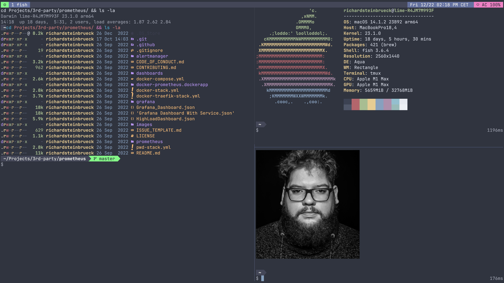

# My Dotfiles


Hi! These are my dotfiles that I use every day, primarily the terminal.
If you find something interesting, go ahead and take whatever you want from my dotfiles.

It is managed using [yadm](https://github.com/TheLocehiliosan/yadm/), a dotfile
manager. This makes it simple to set up a new computer with these files. In
order to set up a new system with these dotfiles, do the following:

## Getting Started

First of all you need yadm, this can be installed on macOS via homebrew or on
Linux via the package manager of your choice.

## macOS

### Install Homebrew

```shell
/bin/bash -c "$(curl -fsSL https://raw.githubusercontent.com/Homebrew/install/master/install.sh)"
```

### Install tools with Homebrew

```shell
brew bundle install --file=.Brewfile
```

## Install tools on ArchLinux

```shell
xargs pacman -S --needed --noconfirm < [.pacmanfile](./.pacmanfile)
```

## Clone dotfiles with [yadm](https://yadm.io/)

```shell
$ yadm clone https://github.com/steinbrueckri/dotfiles
Initialized empty shared Git repository in /steinbrueckri/.config/yadm/repo.git/
remote: Enumerating objects: 295, done.
remote: Counting objects: 100% (283/283), done.
remote: Compressing objects: 100% (133/133), done.
remote: Total 295 (delta 119), reused 282 (delta 118), pack-reused 12
Receiving objects: 100% (295/295), 183.96 KiB | 399.00 KiB/s, done.
Resolving deltas: 100% (120/120), done.
From https://github.com/steinbrueckri/dotfiles
 * [new branch]      master     -> origin/master
Executing /steinbrueckri/.config/yadm/bootstrap
```

## Hardware

### Equipment list

| Device Class | Vendor      | Model                                                                                                                                                       |
| ------------ | ----------- | ----------------------------------------------------------------------------------------------------------------------------------------------------------- |
| Desk         | BoHo-Moebel | [Premium Line with oak table top](https://www.boho-moebel.de/produkte/hoehenverstellbare-tischgestelle/premium-line)                                        |
| Desk Shelf   | Balolo      | [Setup Cockpit](https://www.balolo.de/en/products/setup-cockpit-large)                                                                                      |
| Chaire       | HÅG         | [Capisco 8020](https://www.hag-shop.com/hag/hag-capisco-puls/hag-capisco-puls-8020.html)                                                                    |
| Desk Lamp    | Dyson       | [Solarcycle Morph](https://www.dyson.de/leuchten/tischleuchten/solarcycle-morph-cd06/schwarz)                                                               |
| Monitor      | Apple       | [Studio Display](https://www.apple.com/de/studio-display/)                                                                                                  |
| Keyboard     | Kinesis     | [Advantage360](https://kinesis-ergo.com/keyboards/advantage360/)                                                                                            |
| Mouse        | Kensington  | [Expert Mouse Wireless Trackball](https://www.kensington.com/de-de/p/produkte/ergonomie/ergonomische-eingabeger%C3%A4te/kabelloser-expert-mouse-trackball/) |
| Headphones   | Apple       | [AirPods Max](https://www.apple.com/de/shop/buy-airpods/airpods-max/space-grau)                                                                             |

### Notebook

As my main device i use Macbook Pro 2021 ...

```shell
$ system_profiler SPHardwareDataType | grep -v "UDID\|UUID\|Serial"
Hardware:

    Hardware Overview:

      Model Name: MacBook Pro
      Model Identifier: MacBookPro18,4
      Model Number: Z15K0004WD/A
      Chip: Apple M1 Max
      Total Number of Cores: 10 (8 performance and 2 efficiency)
      Memory: 32 GB
      System Firmware Version: 8419.80.7
      OS Loader Version: 8419.80.7
      Activation Lock Status: Disabled
```

As Keyboard i use a [Kinesis Advantage360](https://kinesis-ergo.com/keyboards/advantage360/)
with the blank keycap set from [Kinesis kc360-bk](https://kinesis-ergo.com/shop/kc360-bk/)
and my Keyboard layouts and macros
for it can be found in [steinbrueckri/Adv360-Pro-ZMK](https://github.com/steinbrueckri/Adv360-Pro-ZMK).


NOTE: Picture need a update 😆

## Key mappings and Aliases

My vim leader key is <space> and the tmux leader is <ctrl><a>. The following
table is generate by ChatGPT so its maybe a lie. ;)

<!-- generate-table-start -->
### nvim Keybindings

| Mode | Shortcut        | Action                                       |
|------|-----------------|----------------------------------------------|
| i    | jk              | <esc>                                        |
| v    | <               | <gv                                         |
| v    | >               | >gv                                         |
| n    | <leader>tq      | toggleQf                                     |
| n    | ]q              | :cnext<CR>                                   |
| n    | [q              | :cprev<CR>                                   |
| n    | gF              | :e <cfile><CR>                               |
| n    | <Esc>           | :noh<CR>                                     |
| n    | <leader><Up>    | :wincmd k<CR>                                |
| n    | <leader><Down>  | :wincmd j<CR>                                |
| n    | <leader><Left>  | :wincmd h<CR>                                |
| n    | <leader><Right> | :wincmd l<CR>                                |
| n    | <Tab>           | :bn<CR>                                      |
| n    | <S-Tab>         | :bp<CR>                                      |
| n    | Z               | :Telescope spell_suggest<CR>                 |
| n    | U               | :redo<CR>                                    |
| n    | <leader>dd      | :bd<CR>                                      |
| n    | n               | nzzzv                                        |
| n    | N               | Nzzzv                                        |
| v    | p               | "_dP                                         |
| n    | <leader>q       | :bdelete<CR>                                 |
| n    | <leader>Q       | :bd!<CR>                                     |
| n    | <leader>e       | :Neotree toggle<CR>                          |
| n    | <leader>A       | :Alpha<CR>                                   |
| n    | <leader>h       | :split<CR>                                   |
| n    | <leader>v       | :vsplit<CR>                                  |
| n    | <leader>w       | :w<CR>                                       |
| n    | <leader>N       | :enew<CR>                                    |
| n    | <leader>fa      | :Telescope live_grep<CR>                     |
| n    | <leader>fe      | :Telescope emoji<CR>                         |
| n    | <leader>fr      | :lua require("spectre").open()<CR>           |
| n    | <leader>fp      | :Telescope yank_history<CR>                  |
| n    | <leader>fB      | :Telescope git_branches<CR>                  |
| n    | <leader>fo      | :Telescope oldfiles<CR>                      |
| n    | <leader>fb      | :Telescope buffers<CR>                       |
| n    | <leader>fu      | :Telescope undo<CR>                          |
| n    | <leader>fk      | :Telescope keymaps<CR>                       |
| n    | <leader>fh      | :Telescope harpoon marks<CR>                 |
| n    | <leader>ga      | :Git add %<CR>                               |
| n    | <leader>gA      | :Git add .<CR>                               |
| n    | <leader>gb      | :Gitsigns blame_line<CR>                     |
| n    | <leader>gd      | :DiffviewOpen<CR>                            |
| n    | <leader>gD      | :DiffviewClose<CR>                           |
| n    | <leader>gg      | :OpenInGHFileLines<CR>                       |
| n    | <leader>gY      | :Git yolo<CR>                                |
| n    | <leader>gn      | :Neogit<CR>                                  |
| n    | <leader>gf      | :!fork status $PWD<CR><CR>                   |
| n    | <leader>nn      | :ObsidianToday<CR>                           |
| n    | <leader>nr      | :ObsidianRename<CR>                          |
| n    | <leader>nf      | :ObsidianSearch<CR>                          |
| n    | <leader>tc      | :ColorizerToggle<CR>                         |
| n    | <leader>td      | :DBUIToggle<CR>                              |
| n    | <leader>to      | :SymbolsOutline<CR>                          |
| n    | <leader>ts      | :Screenkey toggle<CR>                        |
| n    | <leader>tS      | :set spell!<CR>                              |
| n    | <leader>tw      | <cmd>set wrap!<CR>                           |
| n    | <leader>tn      | :set relativenumber!<CR>                     |
| n    | <leader>tm      | :MarkdownPreviewToggle<CR>                   |
| n    | <leader>tR      | :set norelativenumber!<CR>                   |
| n    | <leader>tr      | :TroubleToggle<CR>                           |

### tmux Keybindings

| Shortcut | Action                                                                 |
|----------|------------------------------------------------------------------------|
| C-a      | send-prefix                                                            |
| _        | split-window -h -c "#{pane_current_path}"                               |
| -        | split-window -v -c "#{pane_current_path}"                               |
| h        | switch -t home                                                         |
| u        | switch -t userlike                                                     |
| C        | new                                                                    |
| y        | set-window-option synchronize-panes\; display-message "synchronize-panes is now #{?pane_synchronized,on,off}" |
| v        | copy-mode                                                              |
| p        | paste-buffer                                                           |
| r        | source-file ~/.tmux.conf\; display-message "Reload config! 🔁"          |

### Fish Aliases

| Alias                 | Command                                                                                   |
|-----------------------|-------------------------------------------------------------------------------------------|
| vim                   | nvim                                                                                      |
| vi                    | nvim                                                                                      |
| v                     | nvim                                                                                      |
| n                     | nvim                                                                                      |
| nvim-switch-nightly   | bob use nightly                                                                           |
| nvim-switch-stable    | bob use stable                                                                            |
| lg                    | lazygit                                                                                   |
| lazydot               | lazygit -ucd ~/.local/share/yadm/lazygit -w ~ -g ~/.local/share/yadm/repo.git             |
| kx                    | kubectx                                                                                   |
| k                     | kubectl                                                                                   |
| kc                    | kubecolor                                                                                 |
| kn                    | kubens                                                                                    |
| k-debug               | kubectl run --namespace default -i --tty 'debug-default-$USER' --image=steinbrueckri/debug --restart=Never --rm=true -- bash  |
| k-debug-app           | kubectl run --namespace istio-apps -i --tty 'debug-$USER' --image=steinbrueckri/debug --restart=Never --rm=true -- bash       |
| newpyenv              | PIPENV_VENV_IN_PROJECT=1 pipenv --python 3.11 && echo '{ "venvPath": ".", "venv": ".venv" }' > pyrightconfig.json && source .venv/bin/activate.fish |
| activate_env_datacenter | source ~/Userlike/UserlikeDatacenter/.venv/bin/activate.fish                          |
| activate_env_code     | source ~/Userlike/Userlike/.venv/bin/activate.fish                                       |
| gcpil                 | gcloud compute instances list                                                             |
| gcpal                 | gcloud compute addresses list                                                             |
| gcpssh                | gcloud compute ssh                                                                        |
| gcpsshi               | gcloud compute ssh --internal-ip                                                          |
| gcpsshiap             | gcloud compute ssh --tunnel-through-iap                                                   |
| gcprdpiap             | gcloud compute start-iap-tunnel $1 3389 --local-host-port=localhost:3389 --zone=$2        |
| do                    | doctl                                                                                     |
| do-new                | doctl compute droplet create tmp --region ams3 --size s-2vcpu-2gb --image ubuntu-22-04-x64 --user-data-file .dotfileassets/digitalocean-cloudinit.yaml --ssh-keys "df:17:95:8d:31:56:39:27:d1:04:e3:12:52:36:ed:5b" |
| do-new-ssh            | ssh $(doctl compute droplet list \| grep tmp \| awk "{ print $3}")                        |
| localvm               | multipass launch -c 4 -m 4G -d 50G -n localvm 20.04 --cloud-init .dotfileassets/multipass-common.yaml  |
| dr                    | docker run -it --rm --entrypoint /bin/sh                                                  |
| rm-images             | docker rmi (docker images -q)                                                             |
| tssh                  | tsh ssh (tsh ls \| tail --lines=+3 \| fzf -e \| head -n 1 \| cut -d ' ' -f1)              |
| pwgen                 | date +%s \| sha256sum \| base64 \| head -c 32 ; echo                                      |
| lol                   | git log --pretty=oneline --abbrev-commit --graph --decorate                               |
| cat                   | bat                                                                                       |
| hosts                 | hosts --auto-sudo                                                                         |
| ls                    | eza --icons                                                                               |
| top                   | btop                                                                                      |
| watch                 | viddy                                                                                     |
| myip                  | curl -s -H "Accept: application/json" ipinfo.io \| jq -r .ip                              |
| ag                    | rg                                                                                        |
| tailscale             | /Applications/Tailscale.app/Contents/MacOS/Tailscale                                      |
<!-- generate-table-stop -->

## Screenshots

Here’s a glimpse of my terminal and setup:




## Dotfile Testing

Tests are managed using [Docker](https://docker.com) and [Bats](https://github.com/bats-core). To run tests, execute the following:

- `make`

The default make target will build a Docker image from the `.Dockerfile` and run test cases using Bats found in `.tests`.

### Missing features

Here are some planned improvements for future versions:

- Testing with multiple Neovim versions
- Testing across various Linux distributions
- Testing on macOS
