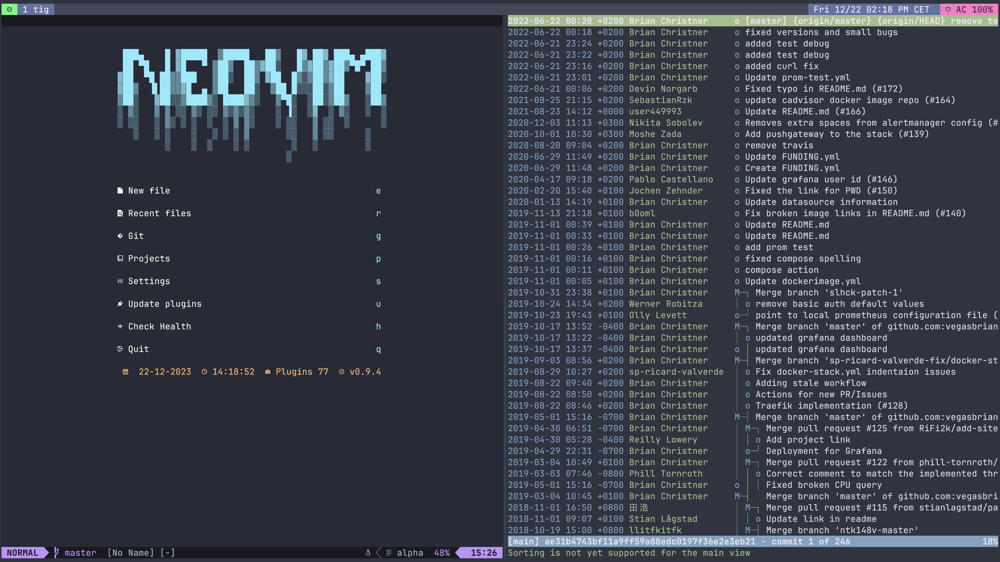

# My Dotfiles


Hi! These are my dotfiles that I use every day, primarily the terminal.
If you find something interesting, go ahead and take whatever you want from my dotfiles.

It is managed using [yadm](https://github.com/TheLocehiliosan/yadm/), a dotfile
manager. This makes it simple to set up a new computer with these files. In
order to set up a new system with these dotfiles, do the following:

## Use

First of all you need yadm, this can be installed on macOS via homebrew or on Linux via the package manager of your choice.

## macOS

### Install Homebrew

```shell
/bin/bash -c "$(curl -fsSL https://raw.githubusercontent.com/Homebrew/install/master/install.sh)"
```

### Install tools with Homebrew on macOS

```shell
brew bundle install --file=.Brewfile
```

## Install tools on ArchLinux

```shell
xargs pacman -S --needed --noconfirm < [.pacmanfile](./.pacmanfile)
```

## Clone dotfiles with [yadm](https://yadm.io/)

```shell
$ yadm clone https://github.com/steinbrueckri/dotfiles
Initialized empty shared Git repository in /steinbrueckri/.config/yadm/repo.git/
remote: Enumerating objects: 295, done.
remote: Counting objects: 100% (283/283), done.
remote: Compressing objects: 100% (133/133), done.
remote: Total 295 (delta 119), reused 282 (delta 118), pack-reused 12
Receiving objects: 100% (295/295), 183.96 KiB | 399.00 KiB/s, done.
Resolving deltas: 100% (120/120), done.
From https://github.com/steinbrueckri/dotfiles
 * [new branch]      master     -> origin/master
Executing /steinbrueckri/.config/yadm/bootstrap
```

## Apply other OS Settings

My macOS settings can you apply with the [osx_settings.sh](./.dotfileassets/osx_settings.sh)

## Hardware

### Equipment list

| Device Class | Vendor      | Model                                                                                                                                                       |
| ------------ | ----------- | ----------------------------------------------------------------------------------------------------------------------------------------------------------- |
| Desk         | BoHo-Moebel | [Premium Line with oak table top](https://www.boho-moebel.de/produkte/hoehenverstellbare-tischgestelle/premium-line)                                        |
| Desk Shelf   | Balolo      | [Setup Cockpit](https://www.balolo.de/en/products/setup-cockpit-large)                                                                                      |
| Chaire       | HÅG         | [Capisco 8020](https://www.hag-shop.com/hag/hag-capisco-puls/hag-capisco-puls-8020.html)                                                                    |
| Desk Lamp    | Dyson       | [Solarcycle Morph](https://www.dyson.de/leuchten/tischleuchten/solarcycle-morph-cd06/schwarz)                                                               |
| Monitor      | Apple       | [Studio Display](https://www.apple.com/de/studio-display/)                                                                                                  |
| Keyboard     | Kinesis     | [Advantage360](https://kinesis-ergo.com/keyboards/advantage360/)                                                                                            |
| Mouse        | Kensington  | [Expert Mouse Wireless Trackball](https://www.kensington.com/de-de/p/produkte/ergonomie/ergonomische-eingabeger%C3%A4te/kabelloser-expert-mouse-trackball/) |
| Headphones   | Apple       | [AirPods Max](https://www.apple.com/de/shop/buy-airpods/airpods-max/space-grau)                                                                             |

### Notebook

As my main device i use Macbook Pro 2021 ...

```shell
$ system_profiler SPHardwareDataType | grep -v "UDID\|UUID\|Serial"
Hardware:

    Hardware Overview:

      Model Name: MacBook Pro
      Model Identifier: MacBookPro18,4
      Model Number: Z15K0004WD/A
      Chip: Apple M1 Max
      Total Number of Cores: 10 (8 performance and 2 efficiency)
      Memory: 32 GB
      System Firmware Version: 8419.80.7
      OS Loader Version: 8419.80.7
      Activation Lock Status: Disabled
```

As Keyboard i use a [Kinesis Advantage360](https://kinesis-ergo.com/keyboards/advantage360/)
with the blank keycap set from [Kinesis kc360-bk](https://kinesis-ergo.com/shop/kc360-bk/) and my Keyboard layouts and macros
for it can be found in [steinbrueckri/Adv360-Pro-ZMK](https://github.com/steinbrueckri/Adv360-Pro-ZMK).


NOTE: Picture need a update 😆

## Screenshots



